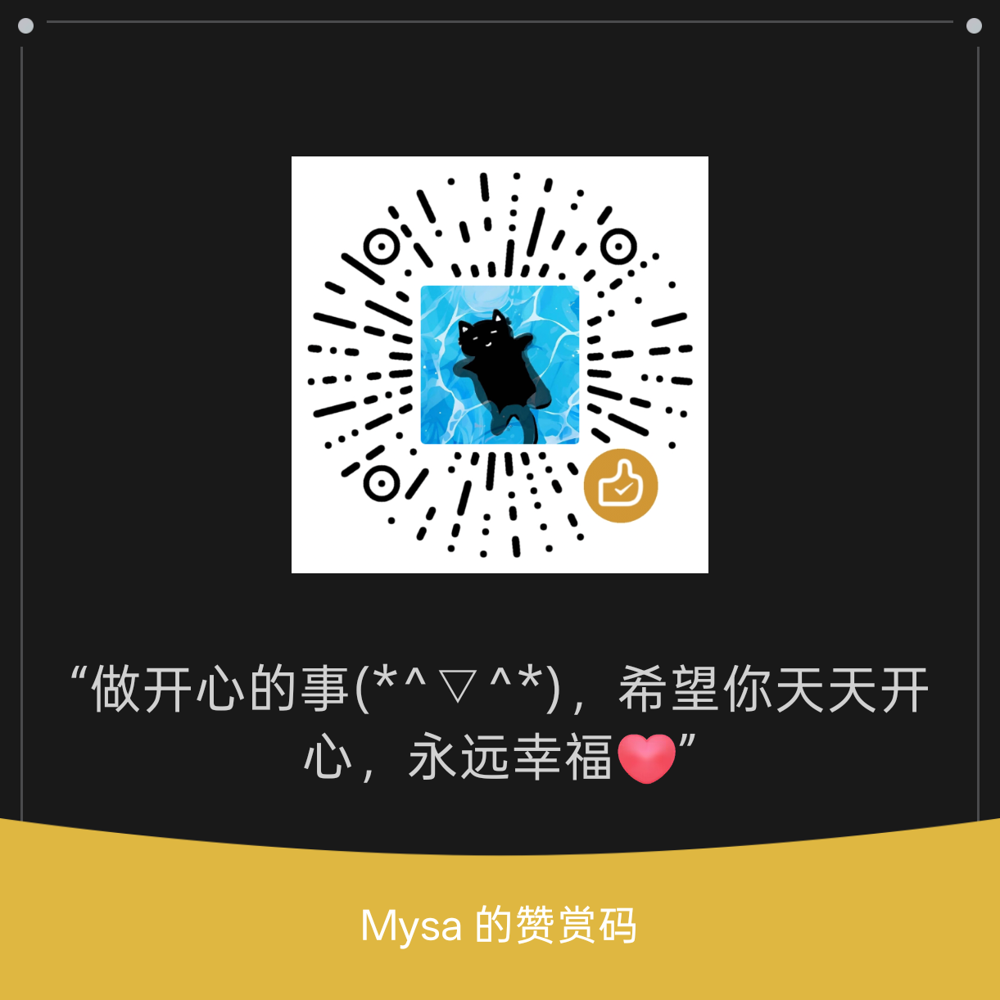

# IcarLyrics

[](../../releases)
[](LICENSE)

iCAR 03 车机多行滚动歌词：**手机取词 → BLE 推送 → 车机悬浮窗渲染**。  
车机播放歌词全程零公网流量；手机厂商车联组件也不会掐断连接。

```
手机播放音乐（任意 App）
  └─ 手机端：MediaSession 监控 → 三源取词（lrclib / 网易云 / QQ音乐）
       └─ BLE GATT Server（Peripheral）Notify 推送歌词 / 进度
            └─ 车机端：GATT Client 按服务 UUID 扫描发现手机并自动连接
                 └─ 悬浮窗滚动歌词（中间三行焦点色放大 · 翻译 · 地图/壁纸双模式）
                      └─ 车机蓝牙栈时间轴对齐 + 偏移 / 对齐 / 颜色
```

## 特性

**连接**
- 车机主动连手机（v2.0 角色对调），不存 MAC、按服务 UUID 发现
- 断线自动重扫重连；MTU 247 + 容错分片协议

**同步**
- 读车机蓝牙栈 MediaSession 进度，对齐实际发声
- 僵尸会话检测；自然切歌立即清词；取词序号防串歌
- 歌词偏移 ±15s（250ms 步进）

**渲染**
- 从屏幕上沿起滚，行数够后沉到屏幕中央
- **中间三行**同放大约 2 号 + 焦点色（与正文色相拉开：白字→蓝焦点 等）
- 固定行高，滚动不抖；防时间轴回跳
- 居左/居中/居右（居左离边约 2cm，不贴边）
- **壁纸模式**全屏多行；**地图模式**自动收到屏幕底部、更小更透（检测高德/百度/腾讯等）
- 颜色：白 / 黑 / 蓝 / 绿 / 琥珀 / 粉

**安装与自启**
- 车机内嵌手机 APK，本地 HTTP `:18765` + 二维码分发
- 读不到系统热点时，用可写 API **直接写入**自生成的 SSID/密码再出合并码
- 两端开机 / 覆盖安装自启；手动停止后不再自启
- ADB 授权帮助可折叠

## 模块

| 目录 | 说明 |
|---|---|
| `app/` | 车机端 |
| `phone/` | 手机端 |
| `.github/workflows/release.yml` | 打 `v*` tag 自动构建并发布 Release |

双端零第三方依赖（纯 Android SDK）。

## BLE 协议

| 项 | UUID |
|---|---|
| Service | `0000A100-CA21-4B58-9C2F-6B1F3C0E9A01` |
| lyrics | `0000A101-…` Notify 歌词分片 |
| progress | `0000A102-…` Notify 进度 JSON |
| cmd | `0000A103-…` clear / setOffset / setAlign / setColor / setScene |

## 部署

### 车机扫码装手机端（推荐）

主界面「2 · 扫码下载手机端」→ 手机联网扫码 → 直接下载
[Release 最新 `IcarLyrics-Phone.apk`](https://github.com/deku772/Icar03/releases/latest/download/IcarLyrics-Phone.apk)。
车机无需开热点；CI 每次发版都会上传稳定文件名。

### ADB 一次性授权（车机）

```bash
adb install app-debug.apk
adb shell appops set com.icarme.lyrics SYSTEM_ALERT_WINDOW allow
adb shell appops set com.icarme.lyrics android:get_usage_stats allow   # 地图/壁纸检测
adb shell pm grant com.icarme.lyrics android.permission.ACCESS_FINE_LOCATION
adb shell cmd notification allow_listener com.icarme.lyrics/.CarMediaListener
adb shell am broadcast -a com.icarme.lyrics.START -n com.icarme.lyrics/.AdbReceiver
```

### ADB（手机）

```bash
adb install phone-debug.apk
adb shell pm grant com.icarme.lyrics.phone android.permission.BLUETOOTH_CONNECT
adb shell pm grant com.icarme.lyrics.phone android.permission.BLUETOOTH_SCAN
adb shell cmd notification allow_listener com.icarme.lyrics.phone/com.icarme.lyrics.phone.NotificationListener
adb shell am broadcast -a com.icarme.lyrics.phone.START -n com.icarme.lyrics.phone/.AdbReceiver
```

## 构建

```bash
# Java 17+ / Gradle 8.14+ / Android SDK 36 / build-tools 35
gradle assembleDebug

git tag v2.4.0 && git push origin v2.4.0
```

## 感谢支持

如果这个项目对你有用，欢迎微信扫码赞赏（与 App 内一致）：



## 许可

[MIT License](LICENSE)
