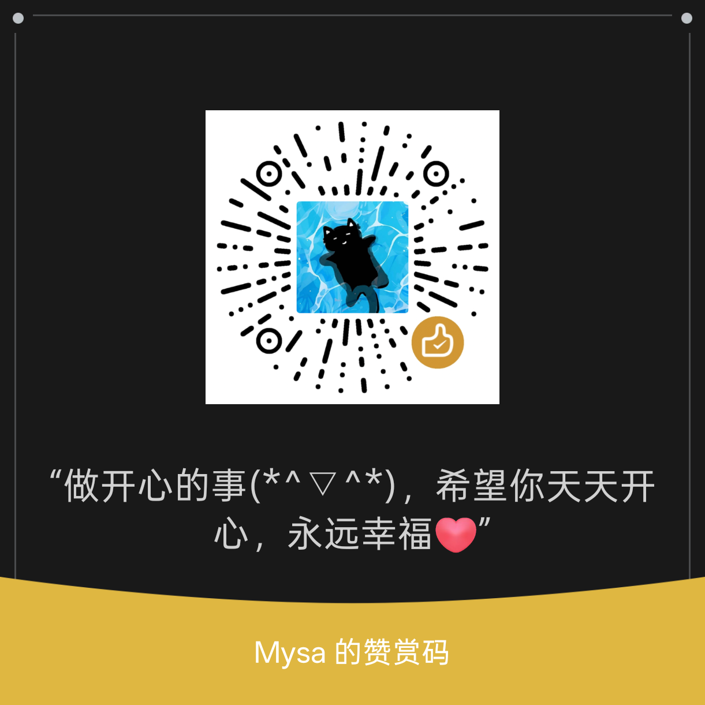

# IcarLyrics

[](../../releases)
[](LICENSE)

iCAR 03 车机多行滚动歌词：**手机取词 → BLE 推送 → 车机悬浮窗渲染**。  
车机播放歌词全程零公网流量；手机厂商车联组件也不会掐断连接。

```
手机播放音乐（任意 App）
  └─ 手机端：MediaSession 监控 → 三源取词（lrclib / 网易云 / QQ音乐）
       └─ BLE GATT Server（Peripheral）Notify 推送歌词 / 进度
            └─ 车机端：GATT Client 按服务 UUID 扫描发现手机并自动连接
                 └─ 悬浮窗滚动歌词（中间三行焦点色放大 · 翻译 · 地图/壁纸双模式）
                      └─ 车机蓝牙栈时间轴对齐 + 偏移 / 对齐 / 颜色
```

## 特性

**连接**
- 车机主动连手机（v2.0 角色对调），不存 MAC、按服务 UUID 发现
- 断线自动重扫重连；MTU 247 + 容错分片协议
- 僵尸 GATT 强制拆除 + 握手看门狗覆盖到订阅完成
- 同曲重连原样补推缓存歌词包，不再先 clear 再取词

**同步**
- 读车机蓝牙栈 MediaSession 进度，对齐实际发声
- **本地时间轴会推给渲染层**（蓝牙/在线皆是）；BLE 进度停包不会把歌词冻死（v2.7.7）
- 渲染层 `tick` + `setInterval` 双心跳，单帧异常不杀死 rAF
- **手动切歌**：扫描全部媒体会话取「不同于当前曲目」的最新元数据（非蓝牙包名优先），并忽略 3s 内蓝牙栈旧歌回灌（v2.7.7）
- 僵尸会话检测；自然切歌立即清词；取词序号防串歌
- 歌词偏移 ±15s（250ms 步进）

**渲染**
- 从屏幕上沿起滚，行数够后沉到屏幕中央
- **中间三行**同放大约 2 号 + 焦点色（与正文色相拉开）
- 固定行高，滚动不抖；防时间轴回跳
- 居左/居中/居右（居左离边约 2cm，不贴边）
- **壁纸**：全屏多行正常显示；**地图**：整段隐藏（不做底部躲闪）
- 显示模式仅「自动 / 始终显示」
- 颜色：白 / 黑 / 蓝 / 绿 / 琥珀 / 粉

**安装与自启**
- 车机内嵌手机 APK，本地 HTTP `:18765` + 二维码分发
- 两端开机 / 覆盖安装自启；手动停止后不再自启
- 服务状态显示本机 IP（ADB 端口 5555），便于调试

## 地图 / 壁纸识别（关键）

车机左上角一键切换壁纸 ↔ 地图。**不要每秒扫 UsageStats**（费电、且 15s 事件窗口会把开着的地图误判回壁纸，歌词过几秒又冒出来）。

实机采样（`settings` 连续 diff）确认，切换只会改这两个键：

| 键 | 位置 | 取值 | 含义 |
|---|---|---|---|
| `com.mengbo.launcher3.SETTINGS_KEY_LAUNCHER_STATE` | **Global** | `1` ↔ `2` | **1=壁纸，2=地图** |
| `setting_tbt_show` | Secure | `0` ↔ `1` | 跟随切换；壁纸上可能是 TBT 卡 |

**当前实现**（`DisplayPolicy` + `OverlayService`）：

1. `ContentObserver` 监听 `SETTINGS_KEY_LAUNCHER_STATE`（事件驱动，几乎不耗电）
2. `launcherState==2` → 地图 → 隐藏歌词；`==1` → 壁纸 → 正常显示
3. 仅在键值未知时，才回退一次 `UsageEvents` 查前台包（`SceneDetector`）
4. `UsageEvents` 查询窗口 ≥3 分钟，并粘住 `lastKnownFgPkg`，禁止 `RunningAppProcesses` 把场景打回壁纸
5. TBT 卡单独出现时**不当**地图隐藏，只压顶部 inset

`notes/analysis-report.md` 记录了 03 歌词 / 厂商私有 Settings 键全表。

## 技术路线

| 层 | 选型 | 原因 |
|---|---|---|
| 角色 | 手机=GATT Server，车机=GATT Client | 手机厂商车联组件会按「车机广播」探查并掐 ACL；对调后手机不再被扫到为车机 |
| 发现 | 服务 UUID `0000A100-CA21-…` | 手机用 RPA，MAC 不可作身份 |
| MTU | 固定 247 | 手机栈 `requestMtu(517)` 会被车机 512 上限打回，连带循环断连 |
| 分片 | LE `frameId u16 + seq + total` | 对齐 `Reassembler`；乱序/重复/丢包可容 |
| 写队列 | 单飞行真 ACK，歌词永不丢、进度可合并 | 防伪释放 |
| 取词 | lrclib → 网易云 → QQ（手机端） | 车机零流量；需 Referer |
| 进度 | 车机 `MediaSession`（蓝牙栈） | 任意音乐 App 通用 |
| 渲染 | 本地 WebView `lyrics_overlay.html` | 逐字动画用 Web 更快 |
| 场景 | Global `SETTINGS_KEY_LAUNCHER_STATE` | 见上文 |
| 空闲 | 手机 12s 未播停 BLE；同曲重连补推缓存包 | 省电且不空窗 |

更细的链路与坑：

- `notes/bluetooth-lyrics-plan.md` — BLE 方案演进
- `notes/BLE连接问题诊断交接-2026-09-10.md` — 循环断连根因（ColorOS 车联组件 / MTU 517）
- `notes/analysis-report.md` — iCAR 03 第三方生态与 Settings 键

## 网络 / 代理策略（重要）

**默认一律直连，不要挂代理。** 仅当 **GitHub 或 Google 确实无法直连** 时，才在代理软件已经打开的前提下临时使用代理。

| 场景 | 是否用代理 |
|---|---|
| 正常构建 / ADB / 拉依赖 / 日常 git | **否**，直连 |
| GitHub Release、仓库 clone/push 打不开 | 先试直连；失败再用**已启动**的代理 |
| Google 相关资源打不开 | 同上 |
| 车机 ADB（局域网 `IP:5555`） | **否**，与 HTTP 代理无关 |

注意：

- 不要假设本机 `127.0.0.1:7890` / `7897` 永远可用。代理软件没开却走了代理，会直接报「代理服务器异常」，流程卡死。
- 会话/终端里的 `http_proxy` / `https_proxy` 用完要清掉；git 全局残留代理同样有害。
- CI 构建应保持无代理环境变量，除非 runner 本身必须翻墙才能访问 GitHub。

## 手机端与红米

手机端负责：读 MediaSession → 三源取词 → BLE Notify 推送歌词/进度。应用包名 `com.icarme.lyrics.phone`，与车机共用 `signing/icarlyrics.keystore`。

**红米 K20 Pro（参考机）**

| 项 | 说明 |
|---|---|
| Root | KernelSU |
| 环境 | Termux + Samba 局域网共享 |
| 方案偏好 | 手机端开机自启；不依赖 PC hosts / 固定 IP |
| 职责 | 作 BLE **Peripheral / GATT Server**，避免被车联组件当「车机广播」掐 ACL |

**手机端约定**

1. 角色不要改回「手机作 Central」——厂商车联会按车机广播探查并断 ACL。
2. 进度包：暂停立即 `playing:false`；写队列卡死重连后**补推缓存歌词 + 最新进度**。
3. 同曲重连**不要**先 `clear` 再取词，避免空窗。
4. 取词需要公网，但不要给整机强制代理；仅取词域名连不上时再临时开代理软件。
5. 定位权限（BLE 扫描）、通知使用权必须授予；省电杀后台会导致 NotificationListener 被摘。

## 模块

| 目录 | 说明 |
|---|---|
| `app/` | 车机端 |
| `phone/` | 手机端 |
| `.github/workflows/release.yml` | 打 `v*` tag 自动构建并发布 Release |
| `signing/` | 项目固定 APK 签名（侧载用，CI/本地一致） |
| `setup-build.ps1` | 本地一键预热 JDK17 + Gradle 8.14 并 `assembleRelease` |
| `notes/` | 技术笔记与诊断记录 |

双端零第三方业务依赖（纯 Android SDK + ZXing）。共用 `signing/icarlyrics.keystore`，避免 CI 每次换 debug key 导致覆盖安装失败。

## BLE 协议

| 项 | UUID |
|---|---|
| Service | `0000A100-CA21-4B58-9C2F-6B1F3C0E9A01` |
| lyrics | `0000A101-…` Notify 歌词分片 |
| progress | `0000A102-…` Notify 进度 JSON |
| cmd | `0000A103-…` clear / setOffset / setAlign / setColor / setScene |

## 部署

### 车机扫码装手机端（推荐）

主界面扫码 → 下载 [IcarLyrics-Phone.apk](https://github.com/deku772/Icar03/releases/latest/download/IcarLyrics-Phone.apk)。  
CI 每次发版都会上传稳定文件名。

### ADB 一次性授权（车机）

```bash
adb connect <车机IP>:5555   # 服务状态页可看本机 IP
adb install app-release.apk
adb shell appops set com.icarme.lyrics SYSTEM_ALERT_WINDOW allow
adb shell appops set com.icarme.lyrics android:get_usage_stats allow   # 场景回退检测
adb shell pm grant com.icarme.lyrics android.permission.ACCESS_FINE_LOCATION
adb shell cmd notification allow_listener com.icarme.lyrics/.CarMediaListener
adb shell am broadcast -a com.icarme.lyrics.START -n com.icarme.lyrics/.AdbReceiver
```

### ADB（手机）

```bash
adb install phone-release.apk
adb shell cmd notification allow_listener com.icarme.lyrics.phone/com.icarme.lyrics.phone.NotificationListener
adb shell am broadcast -a com.icarme.lyrics.phone.START -n com.icarme.lyrics.phone/.AdbReceiver
```

> 选「在线获取」歌词时，请关闭手机音乐软件的「车载蓝牙歌词」，避免抢词。

## 市场参考

小鹏 MONA 03 等车型已支持**系统级完整蓝牙歌词**（连接即展示、无需第三方取词）。本项目仍适用：iCAR 03 无此能力、需要多行滚动/翻译/偏移微调，或希望歌词源可控的场景。

## 构建

```bash
powershell -ExecutionPolicy Bypass -File setup-build.ps1
# 或
gradle assembleRelease

git tag v2.7.7 && git push origin v2.7.7
```

> 调试车机服务：仅广播 `START/STOP` 有时杀不掉 `OverlayService`。应先 `adb shell am force-stop com.icarme.lyrics`，再 `am start …/.MainActivity` 后发 `START` 广播。

## 感谢支持

如果这个项目对你有用，欢迎微信扫码赞赏（与 App 内一致）：



## 许可

[MIT License](LICENSE)
